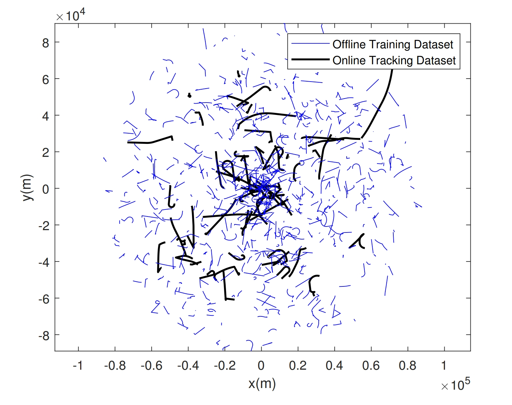
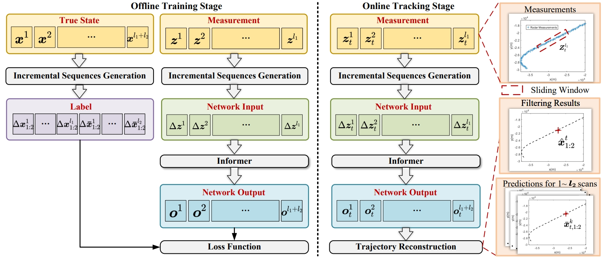
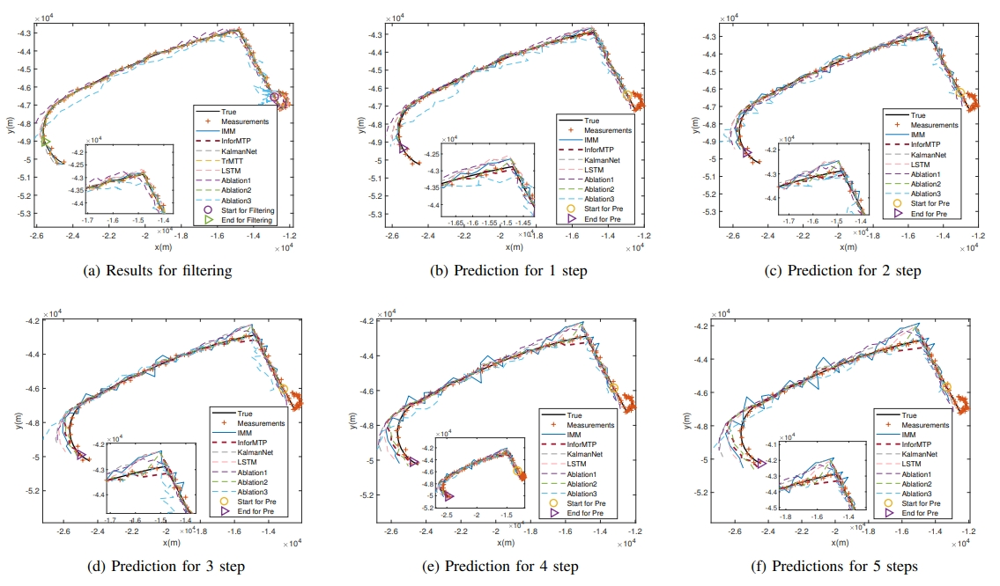

# Informer-Based Joint Tracking and Trajectory Prediction of Maneuvering Radar Targets

This repository is designed to address the radar maneuvering target tracking problem. The project uses Informer as the baseline to achieve real-time tracking and multi-step prediction.

## Paper

This repository provides the official implementation of:

> **Informer-Based Joint Tracking and Trajectory Prediction of Maneuvering Radar Targets**  
> *IEEE Sensors Journal, Volume 26, Issue 2, 2025*  
> DOI: [10.1109/JSEN.2025.3636604](https://doi.org/10.1109/JSEN.2025.3636604)

If you find this work helpful for your research, please cite this paper.

##  Enhanced Datasets Based on LAST

The [LAST dataset](https://github.com/ljx43031/DeepMTT-algorithm) is augmented with velocity jumps and stochastic variations in acceleration and motion patterns. Here is part of the dataset.

  

## Online Tracking and Multi-step Prediction

InforMTP performs online tracking and prediction using a temporal sliding window. At each time step, it outputs a fixed-length sequence of filtered states together with multi-step predictions.

## Requirements

* python==3.10
* numpy==2.3.3
* PyYAML==6.0.2
* scipy==1.16.2
* torch==2.0.1

## Usage Workflow

* **Data Generation**: The data is generated by MATLAB scripts. Navigate to the `matlab/Data_Generation` folder and run `main_gen_data_offline_train.m` and `main_gen_data_online_track.m` to generate offline training data and online tracking data, respectively. The generated data will be saved in the `data/InforMTP` folder.
* **Network Training and Inference:** Run `main_informer.py` to perform training and inference. The trained model weights will be saved in the `checkpoints` folder, and the inference results will be stored in the `matlab/network_output` folder.
* **Trajectory Recovery and Visualization:** Use the MATLAB script `matlab/Trajectory_Recovery/main_revise_data.m` to recover and visualize the tracking results.

## Parameters

The main parameters are recorded in the `config.yaml` file. Edit it to change the data generation and training parameters.

| Parameter Name | Description of Parameter                                     |
| -------------- | ------------------------------------------------------------ |
| M              | Number of trajectories in the offline training dataset       |
| M_track        | Number of trajectories in the online tracking dataset        |
| train_epochs   | Number of training epochs                                    |
| seq_len        | Filter sequence length                                       |
| label_len      | Same with `seq_len`                                          |
| pred_len       | Prediction sequence length                                   |
| N_track        | Length of a single trajectory in the online tracking dataset |
| T              | Time sampling interval                                       |
| R_max          | Maximum target distance                                      |
| V_max          | Maximum target velocity                                      |
| V_min          | Minimum target velocity                                      |
| a_max          | Maximum target acceleration                                  |
| alpha_max      | Minimum target acceleration                                  |
| R              | Variance of Gaussian measurement noise                       |
| Q1             | Variance of target movement noise (position)                 |
| Q2             | Variance of target movement noise (velocity)                 |

## Acknowledgments

This repository is built upon or partially adapts the following open-source projects:

- [Informer](https://github.com/zhouhaoyi/Informer2020)  
  [Informer: Beyond Efficient Transformer for Long Sequence Time-Series Forecasting](https://arxiv.org/abs/2012.07436)

- [DeepMTT](https://github.com/ljx43031/DeepMTT-algorithm)  
  DeepMTT: A deep learning maneuvering target-tracking algorithm based on bidirectional LSTM network
